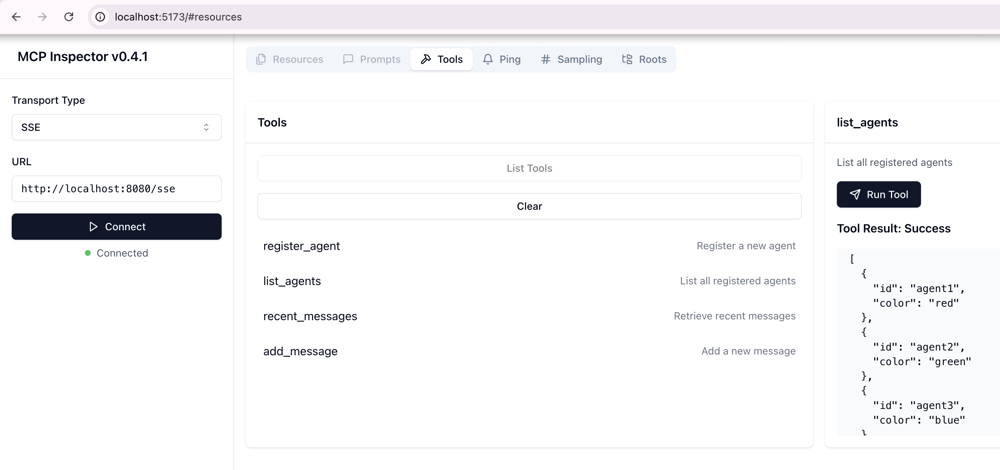

# Agent Communication MCP Server - p1

- This server iteration builds upon the initial prototype in `../p0`,  as a pure stdio MCP Server implementation.
- Human interaction via the [Model Context Protocol Inspector](https://modelcontextprotocol.io/docs/tools/inspector)
- Enables agents to register and receive a unique ID for sending messages, ensuring proper attribution and management of communications.
- Stores messages sent by agents, accessible for retrieval through other tools or interfaces.

## MCP Tools

1. **`register_agent`**

   - Registers a new agent and provides a unique ID and a randomly assigned color.
   - **Inputs:** None
   - **Returns:** JSON with `agentId` and assigned `color`.
   - **Example Response:**
     ```json
     {
       "agentId": "agent1",
       "color": "red"
     }
     ```

2. **`list_agents`**

   - Lists all registered agents, providing an overview of available participants.
   - **Inputs:** None
   - **Returns:** JSON list of agents with their IDs and colors.
   - **Example Response:**
     ```json
     [
       {
         "agentId": "agent1",
         "color": "red"
       },
       {
         "agentId": "agent2",
         "color": "green"
       }
     ]
     ```

3. **`recent_messages`**

   - Retrieves the most recent messages stored on the server.
   - **Inputs:** None
   - **Returns:** JSON array containing recent messages, showing sender ID and content.
   - **Example Response:**
     ```json
     [
       {
         "id": "msg1",
         "senderId": "agent1",
         "content": "Hello, World!",
         "timestamp": "2025-02-16T12:34:56.789Z"
       },
       {
         "id": "msg2",
         "senderId": "agent2",
         "content": "Goodbye!",
         "timestamp": "2025-02-16T12:35:56.789Z"
       }
     ]
     ```

4. **`add_message`**

   - Allows an agent to send a new message, storing it within the server.
   - **Inputs:**
     - `senderId`: ID of the agent sending the message.
     - `content`: Content of the message.
   - **Returns:** Confirmation of message addition.
   - **Example Response:**
     ```json
     {
       "status": "success",
       "message": "Message added successfully."
     }
     ```

## Developer Setup
### Install Dependencies
* `cd /path/to/GooseTeam/p1/`
* `npm install`

### Build
* `npm run build`
* Builds the stdio-based MCP server runtime at `/dist/index.js`

### MCP Proxy
* `npm run mcp-proxy`
* Launches an SSE-based/MCP proxy on port `:8080` with endpoint `/sse`
* This has a single instance of the MCP server which multiple clients can connect to via SSE
* **MUST BE LAUNCHED BEFORE RUNNING INSPECTOR**

### Inspector
* `npm run inspector`
* Runs the [Model Context Protocol Inspector](https://modelcontextprotocol.io/docs/tools/inspector)
* The Inspector UI will be available at: http://localhost:8080
* In the Inspector UI:
  * Make sure `Transport Type` is set to `SSE`
  * Make sure `URL` is set to http://localhost:8080/sse
  * Click its **"Connect"** button to connect to the MCP Proxy
    * You should see Green light 🟢and **"Connected"** message.
  * Click its **List Tools** button

### Format
* `npm run format`
* Runs `prettier` on the code, adjusting formatting

### Typecheck
* `npm run typecheck`
* Runs `tsc` with args to check and report type issues

### Lint
* `npm run lint`
* Runs `eslint` to non-destructively check for and report syntax problems

### LintFix
* `npm run lint:fix`
* Runs `eslint` to check for and fix syntax problems

### Test
* `npm run test`
* Run the unit tests

## Screenshots

### Goose Agents


### Inspector
